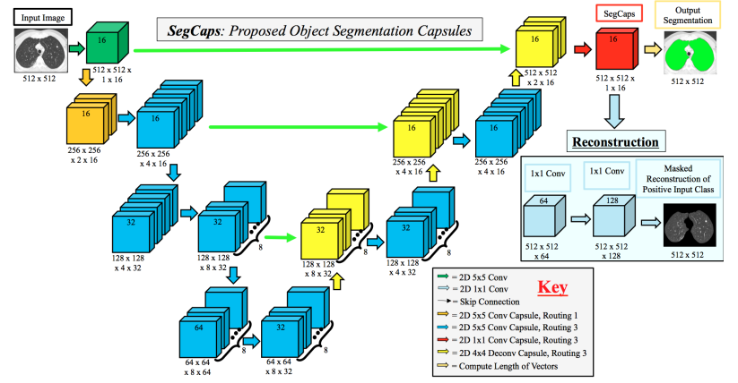
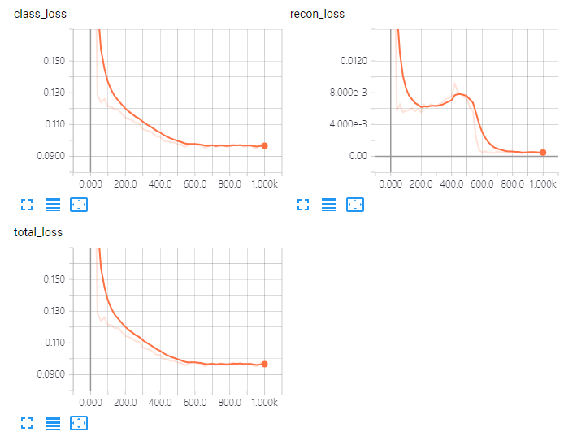
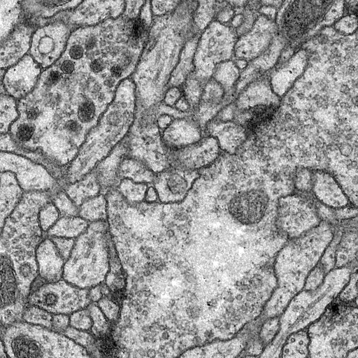
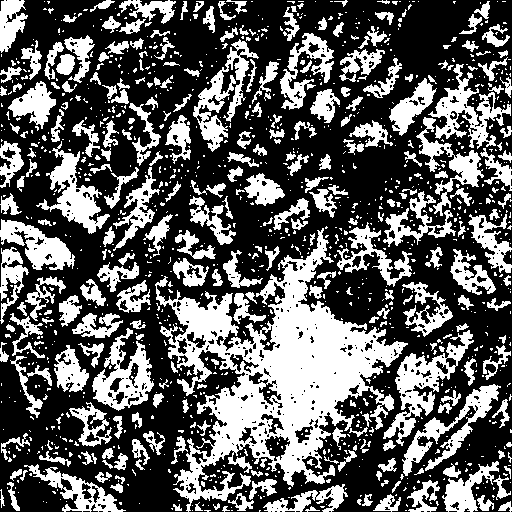

# tf-SegCaps
TensorFlow implementation of SegCaps [1] <br/>
I'm now testing this implementation with ISBI2012. (in progress) <br/>



### Requirements
- python 2.7
- Tensorflow >= 1.4
- numpy
- scipy
- skimage
- cv2

### Usage
Before use, first check options in ```config.py```
```
Options
  batch_size : The number examples in a batch
  max_iter   : The number of iteration of training
  mask       : Whether to use mask in reconsturction loss.
  mask_inv   : Whether to apply color inversion to the image intensity.
```

- trainining: ```python train.py --device 0 --mask True --mask_inv True```
- deployment: ```python deploy.py --device 0 --mask True --mask_inv True```

### Result
- ISBI 2012 dataset

 <br/>

 <br/>
(The result seems too much overfitted, I'm now testing the several data augmentations.)

### Reference
[1] Capsules for Object Segmentation (https://arxiv.org/abs/1804.04241)

### Authors
Inwan Yoo / iwyoo@lunit.io
